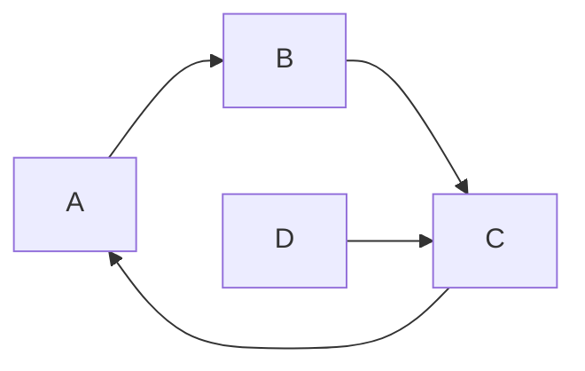

# 某热镀锌工厂管理系统

## 概述
	本系统针对某热镀锌加工厂的生产环节，实现IT化管理。
	该热镀锌工厂的生产流程大致为:

	
	本管理系统对上述生产流程进行自动化管理。并且包含统计报表模块，便于对班组绩效进行统计。特别的:
	
	1. 对订单要求进行全流程可视化管理，便于业务人员对订单进行跟踪，对客户进行汇报。
	2. 热镀锌车间生产环境较为恶劣， 只能利用移动设备(如手机)在车间内进行操作。

## FAQ

Q: 市面上已经有大量的生产管理软件，为什么该厂还要专门定制一套生产软件？
A: 市面上的生产管理软件不能专门针对该厂的生产环节进行定制。而且各个软件之间（比如仓储，财务软件），无法进行互通， 只能通过人工操作保持一致性， 导致经常性的数据不一致， 产生纠纷。

Q: 

